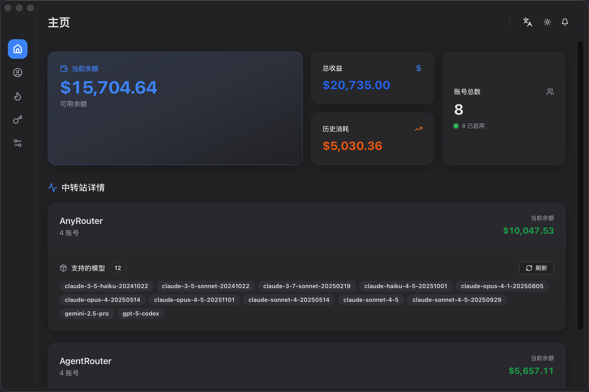
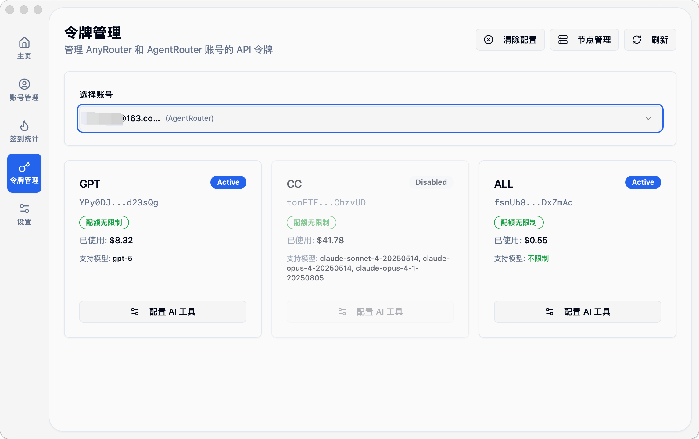

<div align="center">

# NeuraDock

**现代化的自动签到管理系统**

[English](README_EN.md) | 中文

<!-- 核心技术栈 -->
[](https://tauri.app/)
[](https://www.rust-lang.org/)
[](https://react.dev/)
[](https://www.typescriptlang.org/)
[](https://nodejs.org/)

<!-- 项目信息 -->
[](https://github.com/i-rtfsc/NeuraDock/releases)
[](LICENSE)
[](https://github.com/i-rtfsc/NeuraDock/releases)
[](docs/contributing.md)

<!-- 前端技术栈 -->
[](https://vitejs.dev/)
[](https://tailwindcss.com/)
[](https://www.sqlite.org/)

<!-- 代码风格 -->
[](https://github.com/rust-lang/rustfmt)
[](https://prettier.io/)

</div>

---

## 📖 项目概述

NeuraDock 是一个基于 **Tauri 2 + Rust + React** 构建的现代桌面应用，采用 **DDD (领域驱动设计) + CQRS** 架构，支持多服务商账号管理、自动签到、余额追踪等功能。

### ✨ 核心特性

- 🔐 **多账号管理** - 支持多个服务商账号的统一管理
- ⏰ **自动签到** - 可配置时间的每日自动签到调度
- 📊 **余额追踪** - 配额使用情况监控与历史记录
- 🔥 **签到记录** - 连续签到统计、日历视图、趋势分析
- 🎯 **Token 管理** - Claude Code/Codex AI 工具的 Token 配置
- 🛡️ **WAF 绕过** - 使用浏览器自动化绕过 Cloudflare 保护
- 💾 **会话缓存** - 智能会话管理减少浏览器自动化开销
- 🌐 **跨平台** - 支持 macOS、Windows 和 Linux
- 🌍 **国际化** - 支持中文和英文界面

### 📸 界面预览

<table>
<tr>
<td width="50%">

<p align="center"><b>仪表盘 - 余额统计与模型列表</b></p>
</td>
<td width="50%">

<p align="center"><b>账号管理 - 多服务商账号</b></p>
</td>
</tr>
<tr>
<td width="50%">

<p align="center"><b>签到记录 - 连续签到与日历</b></p>
</td>
<td width="50%">

<p align="center"><b>Token管理 - AI工具配置</b></p>
</td>
</tr>
</table>

---

## 🛠️ 技术栈

<table>
<tr>
<td width="50%">

### 后端 (Rust)

| 技术 | 说明 |
|------|------|
| **Tauri 2.1** | 桌面应用框架 |
| **DDD + CQRS** | 架构模式 |
| **SQLite + sqlx** | 数据库 |
| **tauri-specta** | 类型安全 IPC |
| **reqwest** | HTTP 客户端 |
| **chromiumoxide** | 浏览器自动化 |

</td>
<td width="50%">

### 前端 (React)

| 技术 | 说明 |
|------|------|
| **React 18** | UI 框架 |
| **TypeScript 5** | 类型安全 |
| **Vite 6** | 构建工具 |
| **TanStack Query v5** | 服务器状态 |
| **Tailwind CSS** | 样式框架 |
| **Radix UI** | 无障碍组件 |

</td>
</tr>
</table>

---

## 📦 快速开始

### 环境要求

| 依赖 | 版本要求 |
|------|---------|
| Node.js | >= 20.0.0 |
| Rust | >= 1.70.0 |
| 系统 | macOS 10.15+ / Windows 10+ / Linux (Ubuntu 20.04+) |

### 安装与运行

```bash
# 克隆仓库
git clone https://github.com/i-rtfsc/NeuraDock.git
cd NeuraDock

# 安装依赖
make setup

# 启动开发服务器
make dev

# 构建并打包 Release 版本
make build-release
```

**更多命令：**
```bash
make help              # 查看所有可用命令
make dev-fast          # 快速启动开发（跳过检查）
make test-backend      # 运行后端测试
make clean-all         # 深度清理（包括依赖）
```

### 构建输出

| 平台 | 路径 |
|------|------|
| macOS | `apps/desktop/src-tauri/target/release/bundle/dmg/` |
| Windows | `apps/desktop/src-tauri/target/release/bundle/msi/` |
| Linux | `apps/desktop/src-tauri/target/release/bundle/appimage/` |

---

## 🏗️ 项目结构

```
NeuraDock/
├── apps/
│   └── desktop/                    # Tauri 桌面应用
│       ├── src/                    # React 前端
│       │   ├── components/         # UI 组件
│       │   │   ├── account/        # 账号管理组件
│       │   │   ├── checkin/        # 签到组件
│       │   │   ├── notification/   # 通知组件
│       │   │   ├── layout/         # 布局组件
│       │   │   └── ui/             # UI 基础组件
│       │   ├── pages/              # 页面组件
│       │   ├── hooks/              # 自定义 Hooks
│       │   └── lib/                # 工具函数
│       └── src-tauri/              # Rust 后端 (Workspace)
│           └── crates/
│               ├── neuradock-app/           # 应用层 + 表示层
│               │   ├── src/application/     # 应用层 (Commands/Queries)
│               │   └── src/presentation/    # 表示层 (Tauri IPC)
│               ├── neuradock-domain/        # 领域层 (核心业务逻辑)
│               │   └── src/
│               │       ├── account/         # 账号聚合
│               │       ├── balance/         # 余额聚合
│               │       ├── check_in/        # 签到聚合
│               │       ├── session/         # 会话聚合
│               │       ├── notification/    # 通知聚合
│               │       └── plugins/         # 插件系统
│               └── neuradock-infrastructure/ # 基础设施层
│                   ├── src/
│                   │   ├── persistence/     # SQLite 仓储
│                   │   ├── http/            # HTTP 客户端
│                   │   ├── browser/         # 浏览器自动化
│                   │   ├── notification/    # 通知服务
│                   │   └── security/        # 加密服务
│                   └── migrations/          # 数据库迁移
├── docs/                           # 中文文档
│   └── en/                         # 英文文档
└── CLAUDE.md                       # Claude Code 项目指南
```

---

## 🏛️ 架构设计

NeuraDock 采用 **DDD 四层架构 + 多 Crate 组织**：

```
┌─────────────────────────────────────┐
│  表示层 (Tauri IPC)                  │  ← neuradock-app/presentation
│  - commands.rs: Tauri 命令          │  - 暴露命令给前端
│  - events.rs: 事件定义              │  - 发送事件到前端
│  - state.rs: 应用状态管理           │
└─────────────────────────────────────┘
                  ↓
┌─────────────────────────────────────┐
│  应用层 (CQRS)                       │  ← neuradock-app/application
│  - commands/: 命令处理器             │  - 命令/查询分离
│  - queries/: 查询处理器              │  - DTOs 数据传输
│  - services/: 应用服务               │  - CheckInExecutor, Scheduler
│  - dtos/: 数据传输对象              │
└─────────────────────────────────────┘
                  ↓
┌─────────────────────────────────────┐
│  领域层 (核心业务)                   │  ← neuradock-domain/
│  - account/: 账号聚合                │  - 纯业务逻辑
│  - balance/: 余额聚合                │  - 无基础设施依赖
│  - check_in/: 签到聚合               │  - 仓储 Traits
│  - session/: 会话聚合                │  - 领域事件
│  - notification/: 通知聚合           │
│  - plugins/: 插件系统                │
└─────────────────────────────────────┘
                  ↓
┌─────────────────────────────────────┐
│  基础设施层                          │  ← neuradock-infrastructure/
│  - persistence/: SQLite 仓储         │  - 外部集成
│  - http/: HTTP 客户端, WAF 绕过      │  - 实现领域 Traits
│  - browser/: 浏览器自动化            │  - SQLite, HTTP, 浏览器
│  - notification/: 通知服务           │
│  - security/: 加密服务               │
└─────────────────────────────────────┘
```

### 关键设计决策

- 📝 **类型安全 IPC** - 使用 tauri-specta 自动生成 TypeScript 绑定
- 🔀 **CQRS 分离** - 命令修改状态，查询读取状态
- 📡 **事件驱动** - 通过领域事件实现解耦
- 🗄️ **仓储模式** - 抽象数据访问层

---

## 📚 文档

| 文档 | 描述 |
|------|------|
| [快速入门](docs/getting_started.md) | 开始使用 NeuraDock |
| [安装指南](docs/installation.md) | 详细安装说明 |
| [配置指南](docs/configuration.md) | 配置账号和设置 |
| [用户指南](docs/user_guide/README.md) | 完整使用文档 |
| [架构概览](docs/architecture/architecture_overview.md) | 系统架构设计 |
| [API 参考](docs/api/api_reference.md) | Tauri IPC 命令 |
| [贡献指南](docs/contributing.md) | 如何贡献代码 |

---

## 🗺️ 路线图

### Phase 1: Tauri 桌面应用 ✅ 基本完成

- [x] DDD 领域层架构 (多 Crate 组织)
- [x] SQLite 数据库层 (sqlx + 迁移)
- [x] tauri-specta 类型安全 IPC
- [x] 账号 CRUD 操作
- [x] JSON 导入/导出
- [x] 签到执行器 (HTTP + WAF bypass)
- [x] 余额查询和缓存
- [x] 会话管理和缓存
- [x] 自动签到调度器 (tokio-cron-scheduler)
- [x] 通知系统 (飞书 Webhook)
- [x] 多语言支持 (i18n)
- [x] 插件系统基础架构
- [x] Token 管理 (Claude Code/Codex)
- [x] 签到历史和统计（连续签到、日历视图）
- [x] 自定义节点管理
- [x] 清除全局配置功能
- [ ] 更多通知渠道 (邮件、Telegram 等)
- [ ] 更多服务提供商支持
- [ ] 模型使用统计和费用分析

### Phase 2: 增强功能 🔄 进行中

- [ ] 完善测试覆盖 (单元测试 + 集成测试)
- [ ] 性能优化和监控
- [ ] 错误处理和日志改进
- [ ] UI/UX 优化

### Phase 3: VSCode 插件 🔮 未来

- [ ] 提取共享核心到 `packages/core`
- [ ] 支持 WASM 编译
- [ ] 实现 VSCode Extension

---

## 🤝 贡献

欢迎提交 Issue 和 Pull Request！

请先阅读 [贡献指南](docs/contributing.md) 了解如何参与项目开发。

---

## 📄 许可证（GPL 开源 + 售卖商业许可）

- **开源使用（GPLv3）**：代码以 [GNU General Public License v3.0](LICENSE) 形式发布，任何修改或再发布都必须继续遵循 GPLv3 的强制开源条款。
- **商业许可（付费）**：若需闭源发行、商业部署或获取额外授权，请购买 NeuraDock 官方商业许可，以获得合法合规的使用授权及可选支持服务。

购买商业许可或获取授权方案，请通过 Issues、Discussions 或我们的官方联系方式与团队沟通。

---

## 📬 联系方式

- 📝 **Issues**: [GitHub Issues](https://github.com/i-rtfsc/NeuraDock/issues)
- 💬 **Discussions**: [GitHub Discussions](https://github.com/i-rtfsc/NeuraDock/discussions)

---

<div align="center">

**如果这个项目对你有帮助，请给它一个 ⭐ Star！**

Made with ❤️ by NeuraDock Team

</div>
