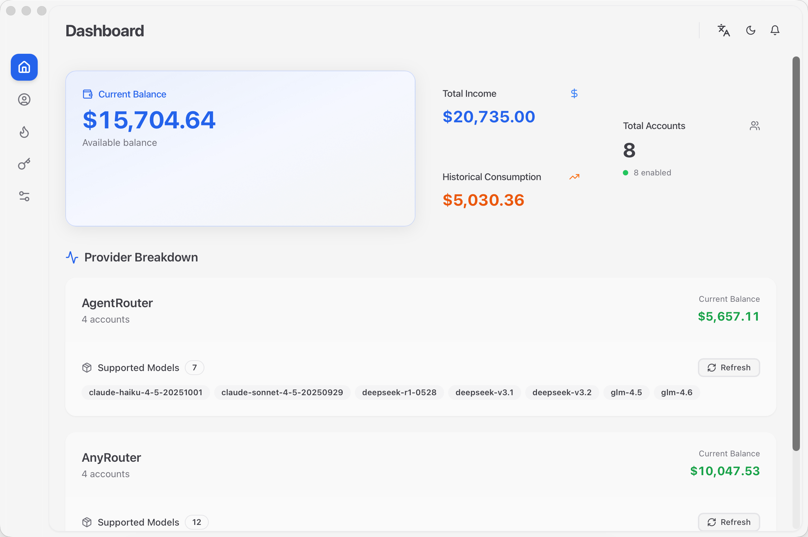
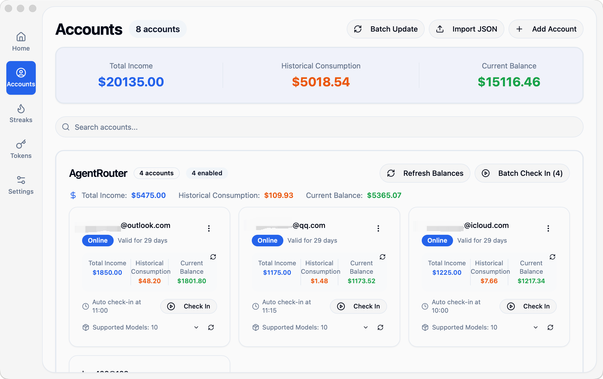
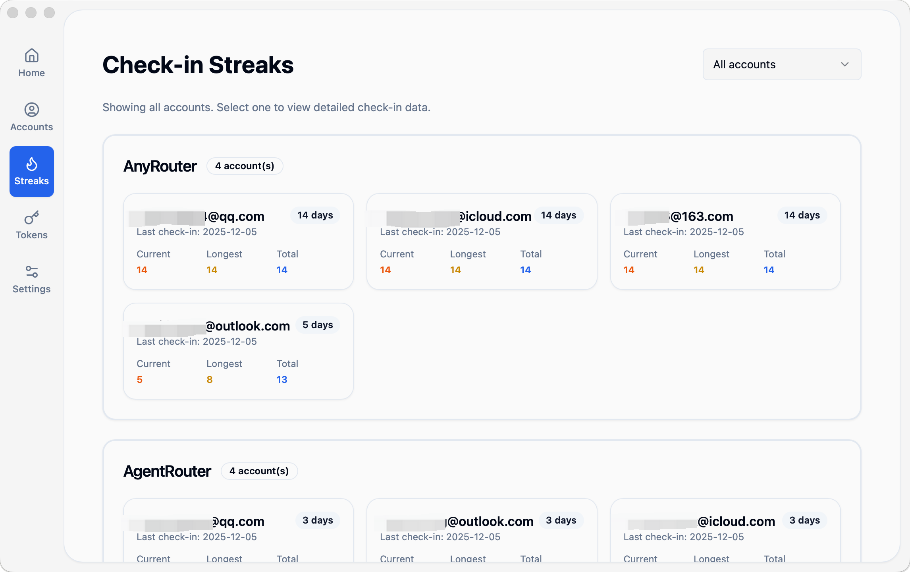

<div align="center">

# NeuraDock

**Modern Automatic Check-in Management System**

[中文](README.md) | English

<!-- Core Tech Stack -->
[](https://tauri.app/)
[](https://www.rust-lang.org/)
[](https://react.dev/)
[](https://www.typescriptlang.org/)
[](https://nodejs.org/)

<!-- Project Info -->
[](https://github.com/i-rtfsc/NeuraDock/releases)
[](LICENSE)
[](https://github.com/i-rtfsc/NeuraDock/releases)
[](docs/en/contributing.md)

<!-- Frontend Tech Stack -->
[](https://vitejs.dev/)
[](https://tailwindcss.com/)
[](https://www.sqlite.org/)

<!-- Code Style -->
[](https://github.com/rust-lang/rustfmt)
[](https://prettier.io/)

</div>

---

## 📖 Overview

NeuraDock is a modern desktop application built with **Tauri 2 + Rust + React**, using **DDD (Domain-Driven Design) + CQRS** architecture. It supports multi-provider account management, automatic check-ins, balance tracking, and more.

### ✨ Key Features

- 🔐 **Multi-Account Management** - Unified management for multiple service provider accounts
- ⏰ **Auto Check-in** - Configurable daily automatic check-in scheduling
- 📊 **Balance Tracking** - Quota usage monitoring and history records
- 🔥 **Check-in Streaks** - Streak statistics, calendar view, and trend analysis
- 🎯 **Token Manager** - Configure tokens for Claude Code/Codex AI tools
- 🛡️ **WAF Bypass** - Browser automation to bypass Cloudflare protection
- 💾 **Session Caching** - Intelligent session management to reduce browser automation overhead
- 🌐 **Cross-Platform** - Supports macOS, Windows, and Linux
- 🌍 **Internationalization** - Supports Chinese and English interfaces

### 📸 Screenshots

<table>
<tr>
<td width="50%">

<p align="center"><b>Dashboard - Balance Stats & Model List</b></p>
</td>
<td width="50%">

<p align="center"><b>Account Management - Multi-Provider</b></p>
</td>
</tr>
<tr>
<td width="50%">

<p align="center"><b>Check-in Streaks - Calendar & Stats</b></p>
</td>
<td width="50%">

<p align="center"><b>Token Manager - AI Tools Config</b></p>
</td>
</tr>
</table>

---

## 🛠️ Tech Stack

<table>
<tr>
<td width="50%">

### Backend (Rust)

| Technology | Description |
|------------|-------------|
| **Tauri 2.1** | Desktop app framework |
| **DDD + CQRS** | Architecture pattern |
| **SQLite + sqlx** | Database |
| **tauri-specta** | Type-safe IPC |
| **reqwest** | HTTP client |
| **chromiumoxide** | Browser automation |

</td>
<td width="50%">

### Frontend (React)

| Technology | Description |
|------------|-------------|
| **React 18** | UI framework |
| **TypeScript 5** | Type safety |
| **Vite 6** | Build tool |
| **TanStack Query v5** | Server state |
| **Tailwind CSS** | Styling |
| **Radix UI** | Accessible components |

</td>
</tr>
</table>

---

## 📦 Quick Start

### Requirements

| Dependency | Version |
|------------|---------|
| Node.js | >= 20.0.0 |
| Rust | >= 1.70.0 |
| System | macOS 10.15+ / Windows 10+ / Linux (Ubuntu 20.04+) |

### Installation

```bash
# Clone the repository
git clone https://github.com/i-rtfsc/NeuraDock.git
cd NeuraDock

# Install dependencies
make setup

# Start development server
make dev

# Build and package Release version
make build-release
```

**More commands:**
```bash
make help              # View all available commands
make dev-fast          # Quick start (skip checks)
make test-backend      # Run backend tests
make clean-all         # Deep clean (including dependencies)
```

### Build Outputs

| Platform | Path |
|----------|------|
| macOS | `apps/desktop/src-tauri/target/release/bundle/dmg/` |
| Windows | `apps/desktop/src-tauri/target/release/bundle/msi/` |
| Linux | `apps/desktop/src-tauri/target/release/bundle/appimage/` |

---

## 🏗️ Project Structure

```
NeuraDock/
├── apps/
│   └── desktop/                    # Tauri desktop application
│       ├── src/                    # React frontend
│       │   ├── components/         # UI components
│       │   │   ├── account/        # Account management components
│       │   │   ├── checkin/        # Check-in components
│       │   │   ├── notification/   # Notification components
│       │   │   ├── layout/         # Layout components
│       │   │   └── ui/             # UI base components
│       │   ├── pages/              # Page components
│       │   ├── hooks/              # Custom hooks
│       │   └── lib/                # Utilities
│       └── src-tauri/              # Rust backend (Workspace)
│           └── crates/
│               ├── neuradock-app/           # Application + Presentation layers
│               │   ├── src/application/     # Application layer (Commands/Queries)
│               │   └── src/presentation/    # Presentation layer (Tauri IPC)
│               ├── neuradock-domain/        # Domain layer (Core business logic)
│               │   └── src/
│               │       ├── account/         # Account aggregate
│               │       ├── balance/         # Balance aggregate
│               │       ├── check_in/        # Check-in aggregate
│               │       ├── session/         # Session aggregate
│               │       ├── notification/    # Notification aggregate
│               │       └── plugins/         # Plugin system
│               └── neuradock-infrastructure/ # Infrastructure layer
│                   ├── src/
│                   │   ├── persistence/     # SQLite repositories
│                   │   ├── http/            # HTTP client
│                   │   ├── browser/         # Browser automation
│                   │   ├── notification/    # Notification service
│                   │   └── security/        # Encryption service
│                   └── migrations/          # Database migrations
├── docs/                           # Chinese documentation
│   └── en/                         # English documentation
└── CLAUDE.md                       # Claude Code project guide
```

---

## 🏛️ Architecture

NeuraDock follows a **DDD 4-Layer Architecture + Multi-Crate Organization**:

```
┌─────────────────────────────────────┐
│  Presentation Layer (Tauri IPC)     │  ← neuradock-app/presentation
│  - commands.rs: Tauri commands      │  - Exposes commands to frontend
│  - events.rs: Event definitions     │  - Emits events to frontend
│  - state.rs: App state management   │
└─────────────────────────────────────┘
                  ↓
┌─────────────────────────────────────┐
│  Application Layer (CQRS)           │  ← neuradock-app/application
│  - commands/: Command handlers      │  - Command/query separation
│  - queries/: Query handlers         │  - DTOs for data transfer
│  - services/: Application services  │  - CheckInExecutor, Scheduler
│  - dtos/: Data transfer objects     │
└─────────────────────────────────────┘
                  ↓
┌─────────────────────────────────────┐
│  Domain Layer (Core Business)       │  ← neuradock-domain/
│  - account/: Account aggregate      │  - Pure business logic
│  - balance/: Balance aggregate      │  - No infrastructure deps
│  - check_in/: CheckIn aggregate     │  - Repository traits
│  - session/: Session aggregate      │  - Domain events
│  - notification/: Notification agg. │
│  - plugins/: Plugin system          │
└─────────────────────────────────────┘
                  ↓
┌─────────────────────────────────────┐
│  Infrastructure Layer               │  ← neuradock-infrastructure/
│  - persistence/: SQLite repos       │  - External integrations
│  - http/: HTTP client, WAF bypass   │  - Implements domain traits
│  - browser/: Browser automation     │  - SQLite, HTTP, Browser
│  - notification/: Notification svc  │
│  - security/: Encryption service    │
└─────────────────────────────────────┘
```

### Key Design Decisions

- 📝 **Type-Safe IPC** - Auto-generated TypeScript bindings via tauri-specta
- 🔀 **CQRS Separation** - Commands modify state, queries read state
- 📡 **Event-Driven** - Decoupling through domain events
- 🗄️ **Repository Pattern** - Abstracted data access layer

---

## 📚 Documentation

| Document | Description |
|----------|-------------|
| [Getting Started](docs/en/getting_started.md) | Start using NeuraDock |
| [Installation](docs/en/installation.md) | Detailed installation guide |
| [Configuration](docs/en/configuration.md) | Configure accounts and settings |
| [User Guide](docs/en/user_guide/README.md) | Complete usage documentation |
| [Architecture](docs/en/architecture/architecture_overview.md) | System architecture design |
| [API Reference](docs/en/api/api_reference.md) | Tauri IPC commands |
| [Contributing](docs/en/contributing.md) | How to contribute |

---

## 🗺️ Roadmap

### Phase 1: Tauri Desktop App ✅ Mostly Complete

- [x] DDD domain layer architecture (Multi-crate organization)
- [x] SQLite database layer (sqlx + migrations)
- [x] tauri-specta type-safe IPC
- [x] Account CRUD operations
- [x] JSON import/export
- [x] Check-in executor (HTTP + WAF bypass)
- [x] Balance query and caching
- [x] Session management and caching
- [x] Auto check-in scheduler (tokio-cron-scheduler)
- [x] Notification system (Feishu Webhook)
- [x] Multi-language support (i18n)
- [x] Plugin system foundation
- [x] Token manager (Claude Code/Codex)
- [x] Check-in history and statistics (streaks, calendar view)
- [x] Custom node management
- [x] Clear global configuration feature
- [ ] More notification channels (Email, Telegram, etc.)
- [ ] More service provider support
- [ ] Model usage statistics and cost analysis

### Phase 2: Enhanced Features 🔄 In Progress

- [ ] Improve test coverage (Unit + Integration tests)
- [ ] Performance optimization and monitoring
- [ ] Error handling and logging improvements
- [ ] UI/UX optimization

### Phase 3: VSCode Extension 🔮 Future

- [ ] Extract shared core to `packages/core`
- [ ] Support WASM compilation
- [ ] Implement VSCode Extension

---

## 🤝 Contributing

Issues and Pull Requests are welcome!

Please read the [Contributing Guide](docs/en/contributing.md) to learn how to participate in project development.

---

## 📄 License (GPL Open Source + Commercial License Sales)

- **Open Source (GPLv3):** Released under the [GNU General Public License v3.0](LICENSE). Any modifications or redistribution must remain GPL-compliant and inherit the copyleft obligations.
- **Commercial License (Paid):** Proprietary, closed-source, or large-scale commercial deployments require purchasing an official NeuraDock commercial license to obtain compliant usage rights and optional support.

To purchase or inquire about commercial licensing, please contact us via Issues, Discussions, or our official communication channels.

---

## 📬 Contact

- 📝 **Issues**: [GitHub Issues](https://github.com/i-rtfsc/NeuraDock/issues)
- 💬 **Discussions**: [GitHub Discussions](https://github.com/i-rtfsc/NeuraDock/discussions)

---

<div align="center">

**If this project helps you, please give it a ⭐ Star!**

Made with ❤️ by NeuraDock Team

</div>
