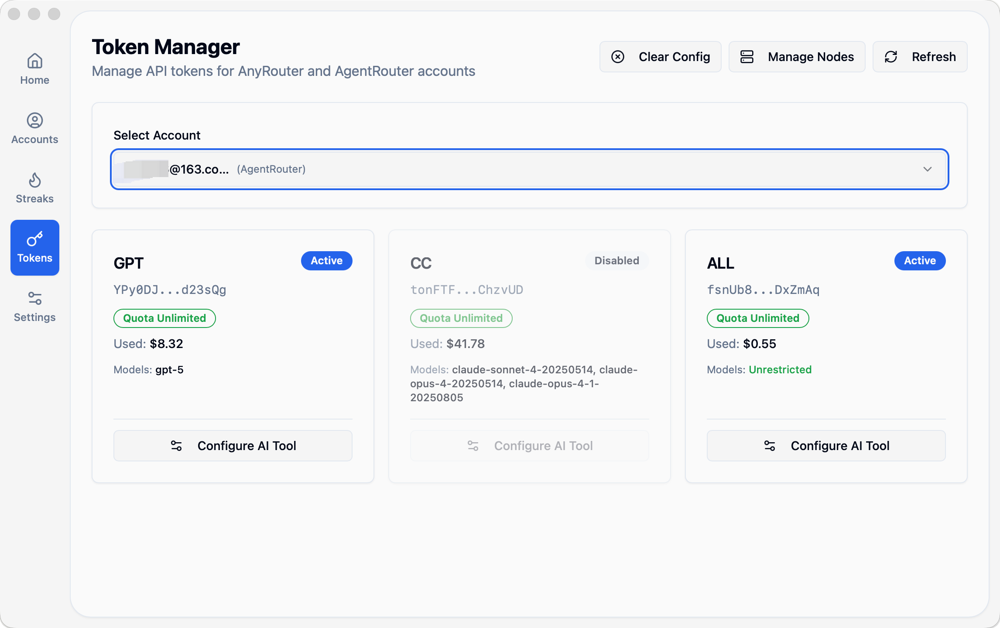
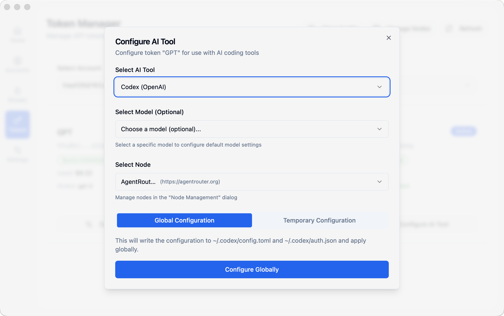

# Token Management

The Token Management feature allows you to configure AI tools (such as Claude Code and Codex) to use API tokens from AnyRouter or AgentRouter, enabling a more flexible AI development experience.



## Feature Overview

- 🎯 **Token List** - View all available tokens under an account
- ⚙️ **Tool Configuration** - Configure tokens for Claude Code or Codex
- 🔧 **Custom Nodes** - Add and manage custom API nodes
- 🧹 **Clear Configuration** - Clear configurations managed by NeuraDock

## Select Account

1. On the Token Management page, select an account from the dropdown menu
2. Only **AnyRouter** and **AgentRouter** accounts are supported
3. After selection, the token list for that account will load automatically

## View Tokens

The token list displays information for each token:

| Field | Description |
|-------|-------------|
| Token Name | Display name of the token |
| Balance | Current remaining balance (USD) |
| Status | Token status (active/expired, etc.) |
| Rate Limit | API call rate limit |

## Configure AI Tools

### Configure Claude Code



1. In the token list, click the **Configure** button next to the token you want to configure
2. In the configuration dialog:
   - Select **AI Tool**: Claude Code or Codex
   - Select **Node**: Default node or custom node
   - Review the configuration preview
3. Click **Apply Configuration**

**Configuration Locations**:
- **Claude Code**: `~/.claude/settings.json`
- **Codex**: `~/.codex/auth.json`

### Configuration Content

The configuration will set the following:

**Claude Code (`~/.claude/settings.json`)**:
```json
{
  "ANTHROPIC_API_KEY": "sk-ant-xxx",
  "ANTHROPIC_BASE_URL": "https://api.anyrouter.top"
}
```

**Codex (`~/.codex/auth.json`)**:
```json
{
  "apiKey": "sk-ant-xxx",
  "baseURL": "https://api.anyrouter.top"
}
```

## Custom Node Management

If you have custom API endpoints (such as privately deployed proxy services), you can add custom nodes.

### Add Custom Node

1. Click the **Manage Nodes** button in the top right
2. Select the service provider (AnyRouter or AgentRouter)
3. Fill in node information:
   - **Node Name**: Custom name (e.g., "My Private Node")
   - **URL**: Base URL of the node (e.g., `https://api.example.com`)
4. Click **Add**

### Delete Custom Node

1. In the node management dialog, find the custom node you want to delete
2. Click the **Delete** button on the right side of the node
3. Confirm deletion

> **Tip**: Built-in nodes cannot be deleted; only custom nodes can be deleted.

## Refresh Tokens

Token information is cached. To get the latest information:

1. Click the **Refresh** button in the top right
2. Wait for loading to complete
3. View the updated token information

## Clear Configuration

If you want to clear global configurations managed by NeuraDock:

1. Click the **Clear Config** button in the top right
2. Select the AI tool to clear (Claude Code or Codex)
3. Confirm the operation

**Clear Effects**:
- **Claude Code**: Removes `ANTHROPIC_API_KEY`, `ANTHROPIC_BASE_URL`, and other fields from `~/.claude/settings.json`
- **Codex**: Deletes the `~/.codex/auth.json` file

## Usage Flow Example

### Scenario: Configure AnyRouter Token for Claude Code

1. **Preparation**
   - Ensure AnyRouter account is added to NeuraDock
   - Account has completed check-in with available tokens

2. **Configuration Steps**
   ```
   Navigate to Token Management page
   → Select AnyRouter account
   → Click "Configure" button for the token you want to use
   → Select AI Tool: Claude Code
   → Select Node: Default node or custom node
   → Click "Apply Configuration"
   ```

3. **Verify Configuration**
   - Open terminal or VSCode
   - Use Claude Code CLI or extension
   - Should be able to call API normally, balance deducted from token

4. **Switch Token**
   - To change tokens, repeat configuration steps
   - New configuration will overwrite old configuration

## Notes

### Token Security

- Tokens contain sensitive information, please keep them safe
- Do not share your tokens with others
- Regularly check token balance and usage

### Configuration Conflicts

- If you have manually configured Claude Code or Codex before, NeuraDock will overwrite the API Key and Base URL
- It's recommended to backup your original configuration before using NeuraDock management

### Cross-Platform Compatibility

- Configuration file paths may vary slightly on different operating systems
- macOS/Linux: `~/.claude/settings.json`
- Windows: `%USERPROFILE%\.claude\settings.json`

## Common Questions

### Q: Why can't I see tokens?

**A**: Possible reasons:
- Account hasn't completed check-in, no tokens generated
- Account type not supported (only AnyRouter/AgentRouter supported)
- Token cache not refreshed, click refresh button

### Q: Claude Code doesn't work after configuration?

**A**: Check:
1. Configuration successfully applied (check for success message)
2. Token has sufficient balance
3. Network connection is normal
4. Restart VSCode or terminal

### Q: How to restore original configuration?

**A**: Two methods:
1. Use "Clear Configuration" feature, then manually reconfigure
2. Directly edit configuration file (`~/.claude/settings.json` or `~/.codex/auth.json`)

### Q: Can I configure multiple tools at once?

**A**: Yes. You can configure different tokens and nodes for Claude Code and Codex separately.

## Related Documentation

- [Account Management](./account_management.md) - Learn how to manage accounts
- [Check-in Operations](./check_in_operations.md) - Check-in to get tokens
- [Configuration Guide](../../configuration.md) - Detailed configuration instructions
