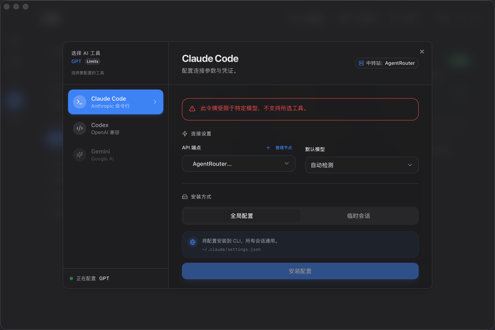

# Token 管理

Token 管理功能允许你配置 AI 工具（如 Claude Code 和 Codex）使用 AnyRouter 或 AgentRouter 的 API Token，实现更灵活的 AI 开发体验。


## 功能概览

- 🎯 **Token 列表** - 查看账号下的所有可用 Token
- ⚙️ **配置工具** - 为 Claude Code 或 Codex 配置 Token
- 🔧 **自定义节点** - 添加和管理自定义 API 节点
- 🧹 **清除配置** - 清除 NeuraDock 管理的配置

## 选择账号

1. 在 Token 管理页面，从下拉菜单选择账号
2. 仅支持 **AnyRouter** 和 **AgentRouter** 账号
3. 选择后会自动加载该账号的 Token 列表

## 查看 Token

Token 列表显示每个 Token 的信息：

| 字段 | 说明 |
|-----|------|
| Token 名称 | Token 的显示名称 |
| 余额 | 当前剩余余额（美元） |
| 状态 | Token 的状态（活跃/已过期等） |
| 速率限制 | API 调用速率限制 |

## 配置 AI 工具

### 配置 Claude Code



1. 在 Token 列表中，点击想要配置的 Token 旁的 **配置** 按钮
2. 在配置对话框中：
   - 选择 **AI 工具**: Claude Code 或 Codex
   - 选择 **节点**: 默认节点或自定义节点
   - 查看预览的配置信息
3. 点击 **应用配置**

**配置位置**：
- **Claude Code**: `~/.claude/settings.json`
- **Codex**: `~/.codex/auth.json`

### 配置内容

配置会设置以下内容：

**Claude Code (`~/.claude/settings.json`)**:
```json
{
  "ANTHROPIC_API_KEY": "sk-ant-xxx",
  "ANTHROPIC_BASE_URL": "https://api.anyrouter.top"
}
```

**Codex (`~/.codex/auth.json`)**:
```json
{
  "apiKey": "sk-ant-xxx",
  "baseURL": "https://api.anyrouter.top"
}
```

## 自定义节点管理

如果你有自定义的 API 端点（如私有部署的中转服务），可以添加自定义节点。

### 添加自定义节点

1. 点击页面右上角的 **管理节点** 按钮
2. 选择服务提供商（AnyRouter 或 AgentRouter）
3. 填写节点信息：
   - **节点名称**: 自定义名称（如"我的私有节点"）
   - **URL**: 节点的基础 URL（如 `https://api.example.com`）
4. 点击 **添加**

### 删除自定义节点

1. 在节点管理对话框中，找到要删除的自定义节点
2. 点击节点右侧的 **删除** 按钮
3. 确认删除

> **提示**：内置节点不能删除，只能删除自定义节点。

## 刷新 Token

Token 信息会被缓存，如需获取最新信息：

1. 点击页面右上角的 **刷新** 按钮
2. 等待加载完成
3. 查看更新后的 Token 信息

## 清除配置

如果你想清除 NeuraDock 管理的全局配置：

1. 点击页面右上角的 **清除配置** 按钮
2. 选择要清除的 AI 工具（Claude Code 或 Codex）
3. 确认操作

**清除效果**：
- **Claude Code**: 从 `~/.claude/settings.json` 中移除 `ANTHROPIC_API_KEY`、`ANTHROPIC_BASE_URL` 等字段
- **Codex**: 删除 `~/.codex/auth.json` 文件

## 使用流程示例

### 场景：为 Claude Code 配置 AnyRouter Token

1. **准备工作**
   - 确保已添加 AnyRouter 账号到 NeuraDock
   - 账号已完成签到，有可用 Token

2. **配置步骤**
   ```
   导航到 Token 管理页面
   → 选择 AnyRouter 账号
   → 点击想要使用的 Token 的"配置"按钮
   → 选择 AI 工具: Claude Code
   → 选择节点: 默认节点或自定义节点
   → 点击"应用配置"
   ```

3. **验证配置**
   - 打开终端或 VSCode
   - 使用 Claude Code CLI 或扩展
   - 应该可以正常调用 API，余额从 Token 中扣除

4. **切换 Token**
   - 如需更换 Token，重复配置步骤
   - 新配置会覆盖旧配置

## 注意事项

### Token 安全

- Token 包含敏感信息，请妥善保管
- 不要分享你的 Token 给他人
- 定期检查 Token 余额和使用情况

### 配置冲突

- 如果你之前手动配置过 Claude Code 或 Codex，NeuraDock 会覆盖 API Key 和 Base URL
- 建议在使用 NeuraDock 管理前备份原有配置

### 跨平台兼容性

- 配置文件路径在不同操作系统上可能略有不同
- macOS/Linux: `~/.claude/settings.json`
- Windows: `%USERPROFILE%\.claude\settings.json`

## 常见问题

### Q: 为什么看不到 Token？

**A**: 可能的原因：
- 账号尚未完成签到，没有生成 Token
- 账号类型不支持（仅 AnyRouter/AgentRouter 支持）
- Token 缓存未刷新，点击刷新按钮

### Q: 配置后 Claude Code 无法使用？

**A**: 检查：
1. 配置是否成功应用（查看成功提示）
2. Token 余额是否充足
3. 网络连接是否正常
4. 重启 VSCode 或终端

### Q: 如何恢复原来的配置？

**A**: 两种方法：
1. 使用"清除配置"功能，然后手动重新配置
2. 直接编辑配置文件（`~/.claude/settings.json` 或 `~/.codex/auth.json`）

### Q: 可以同时为多个工具配置吗？

**A**: 可以。你可以为 Claude Code 和 Codex 分别配置不同的 Token 和节点。

## 相关文档

- [账号管理](./account_management.md) - 了解如何管理账号
- [签到操作](./check_in_operations.md) - 签到获取 Token
- [配置指南](../configuration.md) - 详细配置说明
